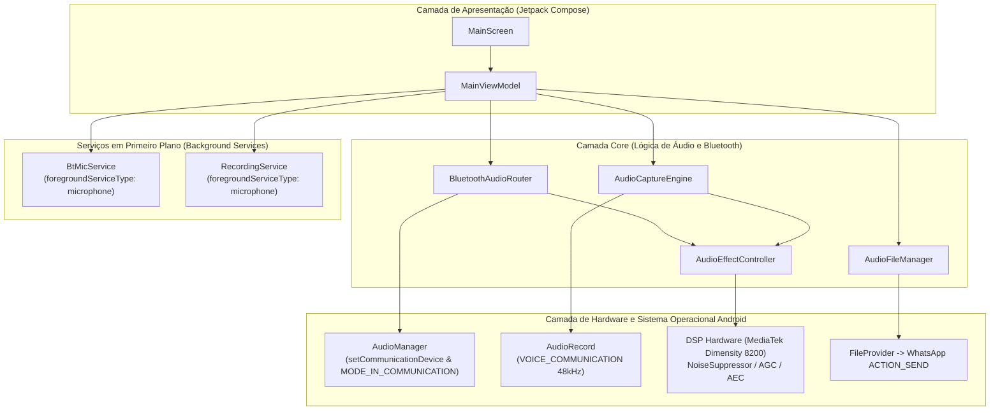

# 🏛️ Arquitetura Técnica — BT Mic Pro

## 1. Visão Geral do Sistema

O **BT Mic Pro** resolve o problema de roteamento e tratamento de microfone Bluetooth no Android através de duas abordagens integradas:

---

## 2. Pipeline do Modo WhatsApp (Roteamento de Microfone)

1. **Ativação**: O usuário ativa a chave no app ou via auto-start no boot do sistema.
2. **Serviço em Primeiro Plano**: `BtMicService` inicia com tipo `microphone` e exibe notificação persistente.
3. **Seleção de Dispositivo**:
   - **Android 12+ (API 31+)**: Utiliza `AudioManager.setCommunicationDevice` com tipo `TYPE_BLUETOOTH_SCO` ou `TYPE_BLE_HEADSET`.
   - **Legado**: Utiliza `startBluetoothSco()` e `setBluetoothScoOn(true)`.
4. **Modo de Comunicação**: O `AudioManager.mode` é configurado para `MODE_IN_COMMUNICATION`.
5. **Efeito no WhatsApp**: Quando o usuário toca para gravar uma mensagem de voz no WhatsApp, o sistema operacional roteia a captura de áudio automaticamente para o fone Bluetooth conectado.

---

## 3. Pipeline do Modo Gravador com Tratamento Anti-Vento (DSP)

1. **Captura em Alta Fidelidade**: `AudioRecord` configurado em `MediaRecorder.AudioSource.VOICE_COMMUNICATION`, 48.000 Hz, 16-bit PCM, Mono.
2. **Cadeia de Filtros Digitais em Tempo Real**:
   - **High-Pass Filter IIR (120 Hz)**:
     $$y[n] = \alpha \cdot (y[n-1] + x[n] - x[n-1])$$
     Elimina frequências mecânicas de ar e vento sem alterar os formantes da voz humana.
   - **Noise Gate Suave com Ganho Compensado**: Atenua ruídos de fundo abaixo do limiar ajustável pelo usuário (10% a 100%).
3. **Geração de Arquivo Canônico**: Escreve o cabeçalho RIFF de 44 bytes e salva como `.wav`.
4. **Compartilhamento Seguro**: O `FileProvider` disponibiliza o URI para o WhatsApp sem expor permissões inseguras de arquivo.
